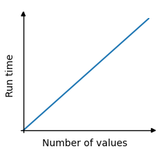

# Arrays

An array is a data structure (DS) used to store multiple elements.

Arrays are used by many algorithms.

In C/CPP, an array can be created like this:

```c
int my_array[] = {9, 14, 7, 22, 8};
```

Arrays are indexed, meaning that each element in the array has an index, a number that says where in the array the element is located. The programming language in this tutorial (C/CPP) use zero-based indexing for arrays, meaning that the first element in an array can be accessed at index 0.

In C, this code use index 0 to write the first element (value 9) to the console:

```c
printf("%d", my_array[0]);
```

Yet in C, to print all the elements of array, you can use this algorithm below:

```c
#include <stdio.h>

int main() {
    int my_array[] = {9, 14, 7, 22, 8};
    int length = sizeof(my_array) / sizeof(my_array[0]); // Calculate the length of the array

    // Printing the C array
    printf("C array: [");
    for (int i = 0; i < length; i++) {
        printf("%d", my_array[i]);
        if (i < length - 1)
            printf(", ");
    }
    printf("]\n");

    return 0;
}
```

## Algorithm: Find The Lowest Value in an Array

Let's create our first algorithm using the array DS.

Below is the algorithm to find the lowest number in an array.

### How it works:

1. Go through the values in the array one by one.
2. Check if the current value is the lowest so far, and if it is, store it.
3. After looking at all the values, the stored value will be the lowest of all values in the array.

## Implementation

Before implementing the algorithm using an actual programming language, it is usually smart to first write the algorithm as a step-by-step procedure.

If you can write down the algorithm in something between human language (pseudocode) and programming language, the algorithm will be easier to implement later because we avoid drowning in all the details of programming language syntax.

1. Create a variable 'minVal' and set it equal to the first value of the array.
2. Go through every element in the array.
3. If the current element has a lower value than 'minVal', update 'minVal' to this value.
4. After looking ar all the elements in the array, the 'minVal' variable now contains the lowest value.

You can also write the algorithm in a way that looks more loke a programming language if you want to, like this:

```
Variable 'minVal' = array[0]
For each element in the array
    If current element < minVal
        minVal = current element
```

After we have written down the algorithm, it is much easier to implement the algorithm in a specifc programming language:

```c
#include <stdio.h>

int main() {
    int my_array[] = {7, 12, 9, 4, 11};
    int size = sizeof(my_array) / sizeof(my_array[0]);
    int minVal = my_array[0];

    for(int i = 0; i < size; i++) {
        if(my_array[i] < minVal) {
            minVal = my_array[i];
        }
    }

    printf("Lowest value: %d\n", minVal);
    return 0;
}
```

## Algorithm Time Complexity

When exploring algorithms, we often look at how long time an algorithm takes to run relative to the size of the data set.

<center>
    
</center>

In the example above, the time the algorithms needs to run is proportional, or linear, to the size of the data set. This is because the algorithm must visit every array element one time to find the lowest value. The loop must run 5 times since there are 5 values in the array. And if the array had 1000 values, the loop would have to run 1000 times.
