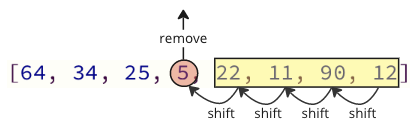
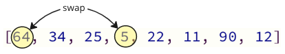

# Selection Sort

O algoritmo Selection Sort encontra o valor mais baixo em um array e o move para a frente do array.

O algoritmo examina o array repetidas vezes, movendo os próximos valores mais baixos para a frente, até que o array seja classificado.

### Como funciona

1. Percorra o array para encontrar o valor mais baixo.
2. Mova o valor mais baixo para a frente da parte não classificada do array.
3. Percorra o array novamente quantas vezes houver valores no array.

## Execução manual

Antes de implementarmos o algoritmo Selection Sort em uma linguagem de programação, vamos executar manualmente um pequeno array apenas uma vez, só para ter uma ideia.

**Etapa 1:** começamos com um array não classificado.

[7, 12, 9, 11, 3]

**Etapa 2:** percorra o array, um valor de cada vez. Qual valor é o menor? 3, certo?

[7, 12, 9, 11, `3`]

**Etapa 3:** Mova o valor mais baixo 3 para a frente do array.

[`3`, 7, 12, 9, 11]

**Etapa 4:** examine o restante dos valores, começando com 7. 7 é o valor mais baixo e já está na frente do array, então não precisamos movê-lo.

[3, `7`,12, 9, 11]

**Etapa 5:** examine o resto do array: 12, 9 e 11. 9 é o valor mais baixo.

[3, 7, 12, `9`,11]

**Etapa 6:** mova 9 para a frente.

[3, 7, `9`,12, 11]

**Etapa 7:** olhando para 12 e 11, 11 é o mais baixo.

[3, 7, 9, 12, `11`]

**Etapa 8:** mova-o para a frente.

[3, 7, 9, `11`,12]

Finalmente, o array é classificada.

## Execução manual: o que aconteceu?

Devemos entender o que aconteceu acima para compreender totalmente o algoritmo, para que possamos implementá-lo em uma linguagem de programação.

Você consegue ver o que aconteceu com o valor mais baixo 3? Na etapa 3, ele foi movido para o início do array, onde pertence, mas nessa etapa o restante do array permanece sem classificação.

Portanto, o algoritmo de classificação por seleção deve percorrer o array repetidas vezes, cada vez que o próximo valor mais baixo for movido na frente da parte não classificada do array, para sua posição correta. A classificação continua até que o valor mais alto 12 seja deixado no final do array. Isso significa que precisamos percorrer o array 4 vezes para classificar o array de 5 valores.

E cada vez que o algoritmo percorre o array, a parte restante não classificada do array fica mais curta.

## Implementação de classificação por seleção

Para implementar o algoritmo Selection Sort em uma linguagem de programação, precisamos:

1. um array com valores para classificar.
2. Um loop interno que percorre o array, encontra o valor mais baixo e o move para a frente do array. Este loop deve percorrer um valor a menos cada vez que for executado.
3. Um loop externo que controla quantas vezes o loop interno deve ser executado. Para um array com valores $\ n$, esse loop externo deve ser executado $\ n - 1$ vezes.

O código resultante fica assim:

```c
#include <stdio.h>

int main() {
    int my_array[] = {64, 34, 25, 5, 22, 11, 90, 12};
    int n = sizeof(my_array) / sizeof(my_array[0]);

    for (int i = 0; i < n-1; i++) {
        int min_index = i;
        for (int j = i+1; j < n; j++) {
            if (my_array[j] < my_array[min_index]) {
                min_index = j;
            }
        }
        int min_value = my_array[min_index];
        for (int k = min_index; k > i; k--) {
            my_array[k] = my_array[k-1];
        }
        my_array[i] = min_value;
    }

    printf("Sorted array: ");
    for (int i = 0; i < n; i++) {
        printf("%d ", my_array[i]);
    }
    printf("\n");

    return 0;
}

// Output: Sorted array: 5 11 12 22 25 34 64 90
```

## Problema de mudança de classificação de seleção

O algoritmo Selection Sort pode ser melhorado um pouco mais.

No código acima, o elemento de menor valor é removido e inserido na frente do array.

Cada vez que o próximo elemento do array de valor mais baixo é removido, todos os elementos seguintes devem ser deslocados uma posição para baixo para fazer uo a remoção.

<center>
    
</center>

Essas operações de mudança levam muito tempo e ainda nem terminamos! Após o valor mais baixo (5) ser encontrado e removido, ele é inserido no início do array, fazendo com que todos os valores seguintes se desloquem uma posição para cima para abrir espaço para o novo valor, como mostra a imagem abaixo.

<center>
    
</center>

## Solução: Trocar Valores!

Em vez de toda a mudança, troque o valor mais baixo (5) pelo primeiro valor (64) como abaixo.

<center>
    
</center>

Podemos trocar valores como mostra a imagem acima porque o valor mais baixo acaba na posição correta, e não importa onde colocamos o outro valor com o qual estamos trocando, porque ele ainda não está classificado.

Aqui está uma implementação do Selection Sort aprimorado, usando troca:

```c
#include <stdio.h>

int main() {
    int my_array[] = {64, 34, 25, 12, 22, 11, 90, 5};
    int n = sizeof(my_array) / sizeof(my_array[0]);

    for (int i = 0; i < n; i++) {
        int min_index = i;
        for (int j = i+1; j < n; j++) {
            if (my_array[j] < my_array[min_index]) {
                min_index = j;
            }
        }
        int temp = my_array[i];
        my_array[i] = my_array[min_index];
        my_array[min_index] = temp;
    }

    printf("Sorted array: ");
    for (int i = 0; i < n; i++) {
        printf("%d ", my_array[i]);
    }
    printf("\n");

    return 0;
}

// Output: Sorted array: 5 11 12 22 25 34 64 90
```

## Complexidade do tempo de classificação da seleção

Seleção de classificação classifica um array de valores $\ n$.

Em média, cerca de $\frac{n}{2}$ elementos são comparados para encontrar o valor mais baixo em cada loop.

E o Selection Sort deve executar o loop para encontrar o valor mais baixo aproximadamente $\ n$ vezes.

Obtemos complexidade de tempo:

$$\theta (\frac{n}{2}\cdot n) = \underline{\underline{\theta(n^2)}}$$

A complexidade de tempo para o algoritmo Selection Sort pode ser exibida em um gráfico como este:

<center>
    
</center>

Como você pode ver, o tempo de execução é o mesmo do Bubble Sort: O tempo de execução aumenta muito rápido quando o tamanho do array aumenta.

A diferença mais significativa do Bubble Sort que podemos notar é que o melhor e o pior caso são, na verdade, quase os mesmos para o Selection Sort $\ \theta(n^2)$, mas para o Bubble Sort o tempo de execução do melhor caso é de apenas $\ \theta (n)$.

A diferença no melhor e no pior caso para a classificação por seleção é principalmente o número de trocas. Na melhor das hipóteses, o Selection Sort não precisa trocar nenhum dos valores porque o array já está classificada. E na pior das hipóteses, onde o array já está ordenado, mas na ordem errada, então o Selection Sort deve fazer tantas trocas quantos valores houver no array.
