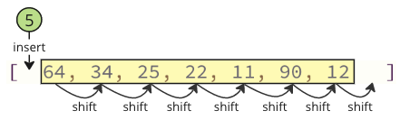
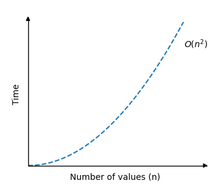

# Selection Sort

The Selection Sort algorithm finds the lowest value in an array and moves it to the front of the array.

The algorithm looks through the array again and again, moving the next lowest values to the front, until the array is sorted.

### How it works

1. Go through the array to find the lowest value.
2. Move the lowest value to the front of the unsorted part of the array.
3. Go through the array again as many times as there are values inthe array.

## Manual Run Through

Before we implement the Selection Sort algorithm in a programming language, let's manually run through a short array only one time, just to get the idea.

**Step 1:** we start with an unsorted array.

[7, 12, 9, 11, 3]

**Step 2:** go through the array, one value at a time. Which value is the lowest? 3, right?

[7, 12, 9, 11, `3`]

**Step 3:** Move the lowest value 3 to the front of the array.

[`3`, 7, 12, 9, 11]

**Step 4:** look through the rest of the values, startinh with 7. 7 is the lowest value, and already at the front of the array, so we don't need to move it.

[3, `7`,12, 9, 11]

**Step 5:** look through the rest of the array: 12, 9 and 11. 9 is the lowest value.

[3, 7, 12, `9`,11]

**Step 6:** move 9 to the front.

[3, 7, `9`,12, 11]

**Step 7:** looking at 12 and 11, 11 is the lowest.

[3, 7, 9, 12, `11`]

**Step 8:** move it to the front.

[3, 7, 9, `11`,12]

Finally, the array is sorted.

## Manual Run Through: What Happened?

We must understand what happened above to fully understand the algorithm, so that we can implementthe algorithm in a programming language.

Can you see what happened to the lowest value 3? In step 3, it has been moved to the start of the array, where it belongs, but at that step the rest of the array remains unsorted.

So the Selection Sort algorithm must run through the array again and again, each time the next lowest value is moved in front of the unsorted part of the array, to its correct position. The sorting continues until the highest value 12 is left at the end of the array. This means that we need to run through the array 4 times, to sort the array of 5 values.

And each time the algorithm tuns through the array, the remaining unsorted part of the array becomes shorter.

## Selection Sort Implementation

To implement the Selection Sort algorithm in a programming language, we need:

1. An array with values to sort.
2. An inner loop that goes through the array, finds the lowest value, and moves it to the front of the array. THis loop must loop through one less value each time it runs.
3. An outer loop that controls how many times the inner loop must run. For an array with $\ n$ values, this outher loop must run $\ n - 1$ times.

The resulting code looks like this:

```c
#include <stdio.h>

int main() {
    int my_array[] = {64, 34, 25, 5, 22, 11, 90, 12};
    int n = sizeof(my_array) / sizeof(my_array[0]);

    for (int i = 0; i < n-1; i++) {
        int min_index = i;
        for (int j = i+1; j < n; j++) {
            if (my_array[j] < my_array[min_index]) {
                min_index = j;
            }
        }
        int min_value = my_array[min_index];
        for (int k = min_index; k > i; k--) {
            my_array[k] = my_array[k-1];
        }
        my_array[i] = min_value;
    }

    printf("Sorted array: ");
    for (int i = 0; i < n; i++) {
        printf("%d ", my_array[i]);
    }
    printf("\n");

    return 0;
}

// Output: Sorted array: 5 11 12 22 25 34 64 90
```

## Selection Sort Shifting Problem

The Selection Sort algorithm can be improved a little bit more.

In the code above, the lowest value element is removed, and them inserted in front of the array.

Each time the next lowest value array element is removed, all following elements must be shifted one place down to make uo for the removal.

<center>
    
</center>

These shifting operation takes a lot of time, and we are not even done yet! After the lowest value (5) is found and removed, it is inserted at the start of the array, causing all following values to shift one position up to make space for the new value, like the image below shows.

<center>
    
</center>

## Solution: Swap Values!

Instead of all the shifting, swap the lowest value (5) with the first value (64) like below.

<center>
    
</center>

We can swap values like the image above shows because the lowest value ends up in the correct position, and it does not matter where we put the other value we are swapping with, because it is not sorted yet.

Here is an implementation of the improved Selection Sort, using swapping:

```c
#include <stdio.h>

int main() {
    int my_array[] = {64, 34, 25, 12, 22, 11, 90, 5};
    int n = sizeof(my_array) / sizeof(my_array[0]);

    for (int i = 0; i < n; i++) {
        int min_index = i;
        for (int j = i+1; j < n; j++) {
            if (my_array[j] < my_array[min_index]) {
                min_index = j;
            }
        }
        int temp = my_array[i];
        my_array[i] = my_array[min_index];
        my_array[min_index] = temp;
    }

    printf("Sorted array: ");
    for (int i = 0; i < n; i++) {
        printf("%d ", my_array[i]);
    }
    printf("\n");

    return 0;
}

// Output: Sorted array: 5 11 12 22 25 34 64 90
```

## Selection Sort Time Complexity

Selection Sort sorts an array of $\ n$ values.

On average, about $\frac{n}{2}$ elements are compared to find the lowest value in each loop.

And Selection Sort must run the loop to find the lowest value approximately $\ n$ times.

We get time complexity:

$$\theta (\frac{n}{2}\cdot n) = \underline{\underline{\theta(n^2)}}$$

The time complexity for the Selection Sort algorithm van be displayed in a graph like this:

<center>
    
</center>

As you can see, the run time is the same as for Bubble Sort: The run time increases really fast when the size of the array is increased.

The most significant difference from Bubble Sort that we can notice is that best and worst case is actually almost the same for Selection Sort $\ \theta(n^2)$, but for Bubble Sort the best case runtime is only $\ \theta(n)$.

The difference in best and worst case for Selection Sort is mainly the numbers of swaps. In the best case scenario Selection Sort does not have to swap any of the values because the array is already sorted. And in the worst case scenario, where the array already sorted, but in the wrong order, so Selection Sort must do as many swaps as there are values in array.
