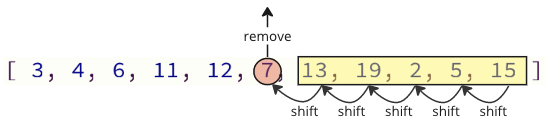
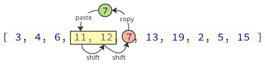

# Insertion Sort

O algoritmo de classificação por inserção usa uma parte do array para armazenar os valores classificados e a outra parte do array para armazenar os valores que ainda não foram classificados.

O algoritmo pega um valor de cada vez da parte não classificada do array e o coloca no lugar certo na parte classificada do array, até que o array seja classificado.

### Como funciona

1. Pegue o primeiro valor da parte não classificada do array.
2. Mova o valor para o local correto na parte classificada do array.
3. Percorra novamente a parte não classificada do array quantas vezes houver valores.

## Execução manual

Antes de implementarmos o algoritmo Insertion Sort em uma linguagem de programação, vamos percorrer manualmente um pequeno array, só para ter uma ideia.

**Etapa 1:** começamos com um array não classificado.

[7, 12, 9, 11, 3]

**Etapa 2:** podemos considerar o primeiro valor como a parte inicial classificada do array. Se for apenas um valor, deve ser ordenado, certo?

[`7`,12, 9, 11, 3]

**Etapa 3:** O próximo valor 12 agora deve ser movido para a posição correta na parte classificada do array. Mas 12 é maior que 7, então já está na posição correta.

[7, `12`, 9, 11, 3]

**Etapa 4:** considere o próximo valor 9.

[7, 12, `9`, 11, 3]

**Etapa 5:** o valor 9 agora deve ser movido para a posição correta dentro da parte classificada do array, então movemos 9 entre 7 e 12.

[7, `9`, 12, 11, 3]

**Etapa 6:** o próximo valor é 11.

[7, 9, 12, `11`, 3]

**Etapa 7:** movemos entre 9 e 12 na parte classificada do array.

[7, 9, `11`,12, 3]

**Etapa 8:** o último valor a ser inserido na posição correta é 3.

[7, 9, 11, 12, `3`]

**Etapa 9:** inserimos 3 na frente de todos os outros valores porque é o valor mais baixo.

[`3`, 7, 9, 11, 12]

## Execução manual: o que aconteceu?

Devemos entender o que aconteceu acima para compreender totalmente o algoritmo, para que possamos implementá-lo em uma linguagem de programação.

O primeiro valor é considerado a parte inicial classificada do array.

Cada valor após o primeiro valor deve ser comparado com os valores da parte ordenada do algoritmo para que possa ser inserido na posição correta.

O algoritmo de classificação por inserção deve percorrer o array 4 vezes, para classificar o array de 5 valores porque não precisamos classificar o primeiro valor.

E cada vez que o algoritmo percorre o array, a parte restante não classificada do array fica mais curta.

## Implementação de classificação por inserção

Para implementar o algoritmo Insertion Sort em uma linguagem de programação, precisamos:

1. um array com valores para classificar.
2. Um loop externo que escolhe um valor a ser classificado. Para um array com valores $\ n$, esse loop externo ignora o primeiro valor e deve ser executado $\ n - 1$ vezes.
3. Um loop interno que percorre a parte classificada do array, para descobrir onde inserir o valor. Se o valor a ser classificado for um índice $\ i$, a parte classificada do array começa com um índice $\ 0$ e termina no índice $\ i - 1$.

O código resultante fica assim:

```c
#include <stdio.h>

int main() {
    int myArray[] = {64, 34, 25, 12, 22, 11, 90, 5};
    int n = sizeof(myArray) / sizeof(myArray[0]);

    for (int i = 1; i < n; i++) {
        int insertIndex = i;
        int currentValue = myArray[i];
        int j = i - 1;

        while (j >= 0 && myArray[j] > currentValue) {
            myArray[j + 1] = myArray[j];
            insertIndex = j;
            j--;
        }
        myArray[insertIndex] = currentValue;
    }

    printf("Sorted array: ");
    for (int i = 0; i < n; i++) {
        printf("%d ", myArray[i]);
    }

    return 0;
}

// Output: "Sorted array: 5 11 12 22 25 34 64 90"
```

## Melhoria na classificação de inserção

A classificação por inserção pode ser melhorada um pouco mais.

A maneira como o código acima primeiro remove um valor e depois o insere em outro lugar é intuitiva. É como você faria o Insertion Sort fisicamente com uma mão de cartas, por exemplo. Se as cartas de baixo valor forem classificadas à esquerda, você escolhe uma nova carta não classificada e a insere no lugar correto entre as outras cartas já classificadas.

O problema com esta forma de programação é que ao remover um valor do array, todos os elementos acima devem ser deslocados uma posição de índice para baixo:

<center>
    
</center>

E ao inserir novamente o valor removido no array, também há muitas operações de deslocamento que devem ser feitas: todos os elementos seguintes devem deslocar uma posição para cima para dar lugar ao valor inserido:

<center>
    
</center>

Essas operações de mudança podem levar muito tempo, especialmente para um array com muitos elementos.

## Solução aprimorada

Podemos evitar a maioria dessas operações de mudança mudando apenas os valores necessários.

<center>
    
</center>

Na imagem acima, o primeiro valor 7 é copiado, depois os valores 11 e 12 são deslocados uma posição para cima no array e, por último, o valor 7 é colocado onde o valor 11 estava antes.

O número de operações de mudança é reduzido de 12 para 2 neste caso.

Esta melhoria é implementada no exemplo abaixo:

```c
#include <stdio.h>

int main() {
    int myArray[] = {64, 34, 25, 12, 22, 11, 90, 5};
    int n = sizeof(myArray) / sizeof(myArray[0]);

    for (int i = 1; i < n; i++) {
        int insertIndex = i;
        int currentValue = myArray[i];
        int j = i - 1;

        while (j >= 0 && myArray[j] > currentValue) {
            myArray[j + 1] = myArray[j];
            insertIndex = j;
            j--;
        }
        myArray[insertIndex] = currentValue;
    }

    printf("Sorted array: ");
    for (int i = 0; i < n; i++) {
        printf("%d ", myArray[i]);
    }

    return 0;
}

// Output: "Sorted array: 5 11 12 22 25 34 64 90"
```

## Complexidade do tempo de classificação de inserção

Seleção de classificação classifica um array de valores $n$.

Em média, cada valor deve ser comparado com cerca de $\frac{n}{2}$ outros valores para descobrir onde inseri-lo.

E o Selection Sort deve executar o loop para inserir um valor em seu lugar correto aproximadamente $n$ vezes.

Obtemos complexidade de tempo para classificação por inserção:

$$\theta( \frac{n}{2} \cdot n) = \underline{\underline{\theta(n^2)}}$$

A complexidade de tempo para classificação por inserção pode ser exibida assim.

<center>
    
</center>
