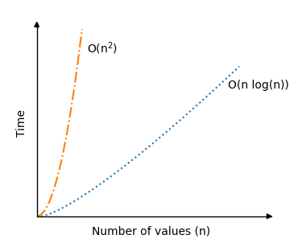

# Quick Sort

Como o nome sugere, QUicksort é um dos algoritmos de classificação mais rápidos.

O algoritmo Quicksort pega um array de valores, escolhe um dos valores como o elemento "pivô" e move os outros valores para que os valores mais baixos fiquem à esquerda do elemento pivô e os valores mais altos fiquem à direita dele.

Neste tutorial, o último elemento do array é escolhido para ser o elemento pivô, mas também poderíamos ter escolhido o primeiro elemento do array, ou qualquer elemento do array, na verdade.

Então, o algoritmo QUicksort executa a mesma operação recursivamente nas subarrayes à esquerda e à direita do elemento pivô. Isso continua até que o array seja classificada.

> [!TIP]
> Recursão é quando uma função chama a si mesma.
> Depois que o algoritmo Quicksort colocou o elemento pivô entre uma subarray com valores mais baixos no lado esquerdo e uma subarray com valores mais altos no lado direito, o algoritmo chama a si mesmo duas vezes, para que o Quicksort seja executado novamente para o subarray no lado esquerdo e para a subarray no lado direito. O algoritmo Quicksort continua a chamar a si mesmo até que as subarrayes sejam muito pequenas para serem classificadas.

O algoritmo pode ser descrito assim:

### Como funciona

1. Escolha um valor no array para ser o elemento pivô.
2. Ordene o restante do array de forma que os valores mais baixos que o elemento pivô fiquem à esquerda e os valores mais altos fiquem à direita.
3. Troque o elemento pivô pelo primeiro elemento de valores mais altos para que o elemento pivô fique entre os valores mais baixos e mais altos.
4. Faça as mesmas operações (recursivamente) para as subarrayes nos lados esquerdo e direito do elemento pivô.

## Execução manual

Antes de implementarmos o algoritmo Quicksort em uma linguagem de programação, vamos executar manualmente um pequeno array, apenas para ter uma ideia.

**Etapa 1:** começamos com um array não classificado.

[11, 9, 12, 7, 3]

**Etapa 2:** escolhemos o último valor 3 como elemento pivô.

[11, 9, 12, 7, `3`]

**Etapa 3:** o restante dos valores no array são todos inferiores a 3, e devem estar no lado direito de 3. Troque 3 por 11.

[`3`,9, 12, 7, `11`]

**Etapa 4:** o valor 3 agora está na posição correta. Precisamos classificar os valores à direita de 3. Escolhemos o último valor 11 como o novo elemento pivô.

[3, 9, 12, 7, `11`]

**Etapa 5:** o valor 7 deve estar à esquerda do valor pivô 11 e 12 deve estar à direita dele. Mova 7 e 12.

[3, 9, `7`, `12`,11]

**Etapa 6:** troque 11 por 12 para que os valores mais baixos 9 e 7 fiquem no lado esquerdo de 11 e 12 fique no lado direito.

[3, 9, 7, `11`, `12`]

**Etapa 7:** 11 e 12 estão nas posições corretas. Escolhemos 7 como elemento pivô na subarray [9, 7], à esquerda de 11.

[3, 9, `7`,11, 12]

**Etapa 8:** devemos trocar 9 por 7.

[3, `7`, `9`,11, 12]

E agora, o array está classificado.

## Execução manual: o que aconteceu?

Antes de implementarmos o algoritmo em uma linguagem de programação, precisamos analisar com mais detalhes o que aconteceu acima.

Já definimos que o último valor do array é escolhido como o elemento pivô, e o restante dos valores são organizados de forma que os valores inferiores ao valor pivô fiquem à esquerda e os valores mais altos fiquem à direita.

Depois disso, o elemento pivô é trocado pelo primeiro dos valores mais altos. Isso divide o array original em dois, com o elemento pivô entre os valores mais baixos e mais altos.

Agora precisamos fazer o mesmo que acima com as subarrayes nos lados esquerdo e direito do antigo elemento pivô. E se uma subarray tiver comprimento 0 ou 1, consideramos que ela terminou a classificação.

Resumindo, o algoritmo Quicksort faz com que as subarrayes fiquem cada vez mais curtas até que o array seja classificada.

## Implementação Quicksort

Para qrite um método "quickSort" que divide o array em subarrayes cada vez mais curtas, usamos recursão. Isso significa que o método "quickSort" deve chamar a si mesmo com as novas subarrayes à esquerda e à direita do elemento pivô.

1. um array com valores para classificar.
2. Um método `quickSort` que chama a si mesmo (recursão) se as subarrayes tiverem tamanho maior que 1.
3. Um método `partition` que recebe uma subarray, move valores, troca o elemento pivô na subarray e retorna o índice onde ocorre a próxima divisão nas subarrayes.

O código resultante fica assim:

```c
#include <stdio.h>

void quicksort(int array[], int low, int high);
int partition(int array[], int low, int high);

int main() {
    int myArray[] = {64, 34, 25, 12, 22, 11, 90, 5};
    int n = sizeof(myArray) / sizeof(myArray[0]);

    quicksort(myArray, 0, n - 1);

    printf("Sorted array: ");
    for (int i = 0; i < n; i++) {
        printf("%d ", myArray[i]);
    }
    return 0;
}

void quicksort(int array[], int low, int high) {
    if (low < high) {
        int pivotIndex = partition(array, low, high);
        quicksort(array, low, pivotIndex - 1);
        quicksort(array, pivotIndex + 1, high);
    }
}

int partition(int array[], int low, int high) {
    int pivot = array[high];
    int i = low - 1;

    for (int j = low; j < high; j++) {
        if (array[j] <= pivot) {
            i++;
            int temp = array[i];
            array[i] = array[j];
            array[j] = temp;
        }
    }

    int temp = array[i + 1];
    array[i + 1] = array[high];
    array[high] = temp;
    return i + 1;
}

// Output: "Sorted array: 5 11 12 22 25 34 64 90"
```

## Complexidade de tempo Quicksort

O pior cenário para Quicksort é $\theta(n^2)$. É quando o elemento pivô é o valor mais alto ou mais baixo em cada subarray, o que leva a muitas chamadas recursivas. Com nossa implementação acima, isso acontece quando o array já está classificado.

Mas, em média, a complexidade de tempo do Quicksort é na verdade apenas $\theta(n \log n)$, o que é muito melhor do que para os algoritmos de classificação anteriores que vimos. É por isso que o Quicksort é tão popular.

Abaixo você pode ver a melhoria significativa na complexidade de tempo para Quicksort em um cenário médio $\theta(n \log n)$, em comparação com os algoritmos de classificação anteriores Bubble, Selection an Insertion Sort com complexidade de tempo $\theta(n^2) $:

<center>
    
</center>

A parte de recursão do algoritmo Quicksort é na verdade uma razão pela qual o cenário de classificação média é tão rápido, porque para boas escolhas do elemento pivô, o array será dividida ao meio de maneira um tanto uniforme cada vez que o algoritmo chamar a si mesmo. Portanto, o número de chamadas recursivas não dobra, mesmo que o número de valores $n$ dobre.
