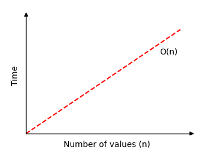

# Busca Linear

O algoritmo de Pesquisa Linear ou Busca Linear pesquisa em um array e retorna o índice do valor que procura.

Se o array já estiver ordenado, é melhor usar o algorimo de busca binária, ele seria muito mais rápido.

Uma grande diferença entre algoritmos de ordenação e de busca é que os algoritmos de ordenação modificam o array, enquanto os algoritmos de busca deixam o array inalterado.

### Como funciona

1. Percorra o array valor por valor a partir do início.
2. Compare cada valor para verificar se é igual ao valor que procuramos.
3. Se o valor for encontrado, retorne o índice desse valor.
4. Se o final do array for atingido e o valor não for encontrado, retorne -1 para indicar que o valor não foi encontrado.

## Execução manual

Abaixo está exemplificado de forma manual o funcionamento da busca linear e após está a implementação na linguagem C. No exemplo, iremos buscar pelo valor 11.

**Etapa 1:** começamos com um array de valores aleatórios.

[12, 8, 9, 11, 5, 11]

**Etapa 2:** podemos observar se o primeiro valor do array é igual a 11.

[`12`, 8, 9, 11, 5, 11]

**Etapa 3:** passando para o próximo valor no índice 1 e comparamos com 11 para ver se é igual.

[12, `8`, 9, 11, 5, 11]

**Etapa 4:** como o valor ainda não foi encontrado, passamos para o próximo índice e verificamos novamente.

[12, 8, `9`, 11, 5, 11]

**Etapa 5:** passando para o próximo índice e verificando se é igual a 11.

[12, 8, 9, `11`, 5, 11]

Número 11 encontrado no índice 3!

Retorna a posição de índice 3 e concluímos a busca.

## Execução manual: o que aconteceu?

Cada valor foi verificado desde o início do array para ver se o valor é igual a 11, o valor que tentamos encontrar.

Quando o valor foi encontrado, a busca foi interrompida e o índice onde o valor foi encontrado foi retornado.

Se o array for pesquisado sem encontrar o valor, -1 seria retornado.

## Implementação da busca linear

Para implementar o algoritmo, precisamos:

1. um array com valores para pesquisar.
2. Um valor alvo para ser buscado.
3. Um loop que percorre o array do início ao fim.
4. Uma condicional que compara o valor atual com o valor alvo e retorna o índice atual se o valor for encontrado.
5. Após o loop, retorne -1, pois nesse ponto sabemos que o valor buscado não foi encontrado.

O algoritmo resultante para Busca Linear pode ser implementado da seguinte forma:

```c
#include <stdio.h>

int linearSearch(int arr[], int size, int targetVal);

int main() {
    int arr[] = {3, 7, 2, 9, 5};
    int targetVal = 9;
    int size = sizeof(arr) / sizeof(arr[0]);

    int result = linearSearch(arr, size, targetVal);

    if (result != -1) {
        printf("Value %d found at index %d\n", targetVal, result);
    } else {
        printf("Value %d not found\n", targetVal);
    }

    return 0;
}

int linearSearch(int arr[], int size, int targetVal) {
    for (int i = 0; i < size; i++) {
        if (arr[i] == targetVal) {
            return i;
        }
    }
    return -1;
}

//C
```

## Complexidade de tempo de busca linear

Se a Busca Linear for executada e encontrar o valor alvo como o primeiro valor do array em uma matriz com $n$ valores, apenas uma comparação é necessária.

Mas se a Busca Linear percorrer todo o conjunto de $n$ valores, sem encontrar o valor alvo, $n$ comparações são necessárias.

Isso significa que a complexidade de tempo para Busca Linear é de: $$O(n)$$

Se desenharmos quanto tempo a Busca Linear precisa para encontrar um valor em uma matriz de $n$ valores, obtemos o gráfico abaixo:

<center>
    
</center>
