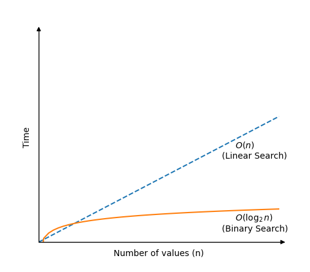

# Binary Search

O algoritmo de Busca Binária pesquisa em um array e retorna o índice do valor que procura.

A Busca Binária, é muito mais rápida que a Busca Linear, mas requer um array ordenado para funcionar.

O algoritmo de Busca Binária funciona verificando o valor no centro do array. Se o valor alvo for inferior, o próximo valor a verificar estará no centro da metade esquerda do array. Essa forma de buscar significa que a área de pesquisa é sempre metade da área de pesquisa anterior, e é por isso que o algoritmo de Busca Binária é tão rápido.

Esse processo de reduzir pela metade a área de pesquisa acontece até que o valor alvo seja encontrado ou até que a área de pesquisa do array esteja vazia.

### Como funciona:

1. Verifique o valor no centro do array.
2. Se o valor alvo for menor, pesquise na metade esquerda do array. Se o valor alvo for maior, pesquise na metade direita.
3. Continue as etapas 1 e 2 para a nova parte reduzida do array até que o valor alvo seja encontrado ou até que a área esteja vazia.
4. Se o valor for encontrado, retorne o índice do valor alvo. Se o valor alvo não for encontrado, retorne -1.

## Execução manual

Vamos tentar fazer a busca manualmente, apenas para entender ainda melhor como funciona a Busca Binária antes de implementá-la em uma linguagem de programação. Procuraremos o valor 11.

**Etapa 1:** começamos com um array.

[2, 3, 7, 7, 11, 15, 25]

**Etapa 2:** o valor no meio do array no índice 3 é igual a 11?

[2, 3, 7, `7`, 11, 15, 25]

**Etapa 3:** 7 é menor do que 11, então devemos procurar 11 à direita do índice 3. Os valores à direita do índice 3 são [11, 15, 25]. O próximo valor a verificar é o valor intermediário 15, no índice 5.

[ 2, 3, 7, 7, 11, `15`, 25]

**Etapa 4:** 15 é maior que 11, então devemos pesquisar à esquerda do índice 5. Já verificamos o índice 0-3, então o índice 4 é o único valor que resta para verificar.

[ 2, 3, 7, 7, `11`, 15, 25]

Encontrado!

O valor 11 foi encontrado no índice 4.

Retornamos a posição do índice 4, resultando na conclusão da busca.

## Execução manual: o que aconteceu?

Para começar, o algoritmo possui duas variáveis "esquerda" e "direita".

A "esquerda" é 0 e representa o índice do primeiro valor no array, enquanto "direita" é representada pelo índice do último valor no array.

Para encontrar o índice do meio do array é utilizado a fórmula $(left+right)/2$, que no array utilizado para exemplificar a execução manual seria $(0+6)/2=3$. O valor encontrado no índice 3 é utilizado para verificar se o número contido é maior ou menor que o número alvo, que no caso seria o número 7 que por sua vez é menor que 11, então a busca continua na parte da direita do array utilizado no exemplo.

Assim é feito sucessivamente até encontrar o número alvo dentro do array, sendo que quando o alvo não for encontrado o valor -1 deverá ser retornado.

## Implementação de busca binária

Para implementar o algoritmo de busca binária, precisamos:

1. Um vetor com valores para pesquisar.
2. Um valor alvo a ser pesquisado.
3. Um loop que é executado enquanto o índice esquerdo for menor ou igual ao índice direito.
4. Uma condicional para comparar o valor médio com o valor alvo e retornar o índice se o valor alvo for encontrado.
5. Uma condicional para verificar se o valor alvo é menor ou maior que o valor médio e atualizar as variáveis "esquerda" e "direita" para restringir a área de pesquisa.
6. Após o loop, retorne -1, pois nesse ponto sabemos que o valor alvo não foi encontrado.

O algoritmo resultante para a Busca Binária é semelhante a este:

```c
#include <stdio.h>

int binarySearch(int arr[], int size, int targetVal);

int main() {
    int myArray[] = {1, 3, 5, 7, 9, 11, 13, 15, 17, 19};
    int myTarget = 15;
    int size = sizeof(myArray) / sizeof(myArray[0]);

    int result = binarySearch(myArray, size, myTarget);

    if (result != -1) {
        printf("Value %d found at index %d\n", myTarget, result);
    } else {
        printf("Target not found in array.\n");
    }

    return 0;
}

int binarySearch(int arr[], int size, int targetVal) {
    int left = 0;
    int right = size - 1;

    while (left <= right) {
        int mid = (left + right) / 2;

        if (arr[mid] == targetVal) {
            return mid;
        }

        if (arr[mid] < targetVal) {
            left = mid + 1;
        } else {
            right = mid - 1;
        }
    }

    return -1;
}

//C
```

## Complexidade de tempo de Busca Binária

Cada vez que a Busca binária verifica um novo valor para ver se é o alvo, a área de pesquisa é dividida pela metade.

Isso significa que mesmo no pior cenário, onde a Busca Binária não consegue encontrar o valor alvo, ela ainda precisa apenas $\log_{2}n$ comparações para examinar um vetor ordenado de $n$ valores.

A complexidade de tempo para a pesquisa binária é de: $$O( \log_{2} n )$$

> [!TIP]
> Ao escrever a complexidade de tempo usando a notação Big O, também poderíamos ter escrito $O( \log n )$, mas $O( \log_{2} n )$ nos lembra que a área de busca no array é reduzida à metade a cada nova comparação, que é o conceito básico da Busca Binária, portanto menteremos apenas a indicação da base 2 nesse caso.

Se desenharmos quanto tempo a Busca Binária precisa para encontrar um valor em um array de $n$ valores, em comparação com a Busca Linear, obtemos este gráfico:

<center>
    
</center>
