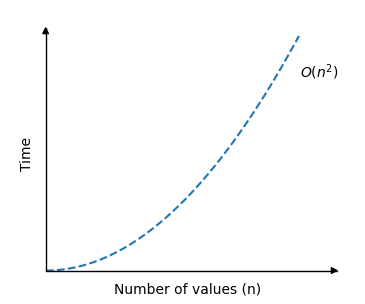

# Bubble Sort

Bubble Sort is an algorithm that sorts an array from the lowest value to the highest value.

The word 'Bubble' comes from how this algorithm works, it makes the highest values 'bubble up'.

### How it works

1. Go through the array, one value at a time.
2. For each value, compare the value with the next value.
3. If the value is higher than the next one, swap the values so that the highest value comes last.
4. Go through the array as many times as there are values in the array.

## Manual Run Through

Before we implement the Bubble Sort algorithm in a programming language, let's manually run through a short array only one time, just to get the idea.

> [!TIP]
> The first loop was done step by step (steps 1 to 8), but for simplicity, after step 8 each step is a loop.

**Step 1:** we start with an unsorted array.

[7, 12, 9, 11, 3]

**Step 2:** we look at the two first values. Does the lowest value come first? Yes, so we don't need to swap them.

[<span style="background-color: #FFFF00">7, 12,</span> 9, 11, 3]

**Step 3:** take one step forward and look at values 12 and 9. Does the lowest value come first? No.

[7, <span style="background-color: #FFFF00">12, 9,</span> 11, 3]

**Step 4:** so we need to swap them so that 9 comes first.

[7, <span style="background-color: #FFFF00">9, 12,</span> 11, 3]

**Step 5:** taking one step forward, looking at 12 and 11.

[7, 9, <span style="background-color: #FFFF00">12, 11, </span> 3]

**Step 6:** we must swap so that 11 comes before 12.

[7, 9, <span style="background-color: #FFFF00">11, 12, </span> 3]

**Step 7:** looking at 12 and 3, do we need to swap them? Yes.

[7, 9, 11, <span style="background-color: #FFFF00">12, 3</span>]

**Step 8:** Swapping 12 and 3, so that 3 comes first.

[7, 9, 11, <span style="background-color: #FFFF00">3, 12</span>]

**Step 8:** Swapping 12 and 3, so that 3 comes first.

[7, 9, 11, <span style="background-color: #FFFF00">3, 12</span>]

**Step 9:** Continuing with the next iteration, we start again from the beginning.

[<span style="background-color: #FFFF00">7, 9,</span> 11, 3, 12]

[7, <span style="background-color: #FFFF00">9, 11,</span> 3, 12]

[7, 9, <span style="background-color: #FFFF00">11, 3,</span> 12]

[7, 9, <span style="background-color: #FFFF00">3, 11,</span> 12]

[<span style="background-color: #FFFF00">7, 9,</span> 3, 11, 12]

**Step 10:** Another iteration.

[7, <span style="background-color: #FFFF00">9, 3,</span> 11, 12]

[7, 3, <span style="background-color: #FFFF00">9, 11,</span> 12]

[7, 3, 9, <span style="background-color: #FFFF00">11, 12</span>]

**Step 11:** One more iteration.

[<span style="background-color: #FFFF00">7, 3,</span> 9, 11, 12]

[3, <span style="background-color: #FFFF00">7, 9,</span> 11, 12]

[3, 7, <span style="background-color: #FFFF00">9, 11,</span> 12]

[3, 7, 9, <span style="background-color: #FFFF00">11, 12</span>]

**Step 12:** Final iteration.

[<span style="background-color: #FFFF00">3, 7,</span> 9, 11, 12]

[3, <span style="background-color: #FFFF00">7, 9,</span> 11, 12]

[3, 7, <span style="background-color: #FFFF00">9, 11,</span> 12]

[3, 7, 9, <span style="background-color: #FFFF00">11, 12</span>]

[3, 7, 9, 11, <span style="background-color: #FFFF00">12</span>]

**Sorted array:** [3, 7, 9, 11, 12]

## Manual Run Through: What Happened?

We must understand what happened in this first run through to fully understand the algorithm, so that we can implement the algorithm in a programming language.

Can you see what happened to the highest value 12? It has bubbled up to the end of the array, where it belongs. But the rest of the array remains unsorted.

So the Bubble Sort algorithm must run through the array again, and again, and again, each time the next highest value bubbles up to its correct position. The sorting continues until the lowest value 3 is left at the start of the array. This means that we need to run through the array 4 times, to sort the array of 5 values.

And each time the algorithm runs through the array, the remaining unsorted part of the array becomes shorter.

## Bubble Sort Implementation

To implement the Bubble Sort algorithm in a programming language, we need:

1. An array with to sort.
2. An inner loop that goes through the array and swaps values if the first value is higher than the next value. This loop must loop through one less value each time ir runs.
3. An outer loop that controls how many times the inner loop must run. For an array with n values, this outer loop must run n-1 times.

The resulting code looks like this:

```c
#include <stdio.h>

int main() {
    int my_array[] = {64, 34, 25, 12, 22, 11, 90, 5};
    int n = sizeof(my_array) / sizeof(my_array[0]);

    for (int i = 0; i < n-1; i++) {
        for (int j = 0; j < n-i-1; j++) {
            if (my_array[j] > my_array[j+1]) {
                int temp = my_array[j];
                my_array[j] = my_array[j+1];
                my_array[j+1] = temp;
            }
        }
    }

    printf("Sorted array: ");
    for (int i = 0; i < n; i++) {
        printf("%d ", my_array[i]);
    }
    printf("\n");

    return 0;
}

// output: "Sorted array: 5 11 12 22 25 34 64 90"
```

## Bubble Sort Improvement

The Bubble Sort algorithm can be improved a little bit more.

Imagine that the array is almost sorted already, with the lowest numbers at the start, like for example:

```
my_array = [7, 3, 9, 12, 11]
```

In this case, the array will be sorted after the first run, but the Bubble Sort algorithm will continue to run, without swapping elements, and that is not necessary.

If the algorithm goes through the array one time without swapping any values, the array must be finished sorted, and we can stop the algorithm, like this:

```c
#include <stdio.h>
#include <stdbool.h>

int main() {
    int my_array[] = {7, 3, 9, 12, 11};
    int n = sizeof(my_array) / sizeof(my_array[0]);

    for (int i = 0; i < n-1; i++) {
        bool swapped = false;
        for (int j = 0; j < n-i-1; j++) {
            if (my_array[j] > my_array[j+1]) {
                int temp = my_array[j];
                my_array[j] = my_array[j+1];
                my_array[j+1] = temp;
                swapped = true;
            }
        }
        if (!swapped) {
            break;
        }
    }

    printf("Sorted array: ");
    for (int i = 0; i < n; i++) {
        printf("%d ", my_array[i]);
    }
    printf("\n");

    return 0;
}

// Output: "Sorted array: 3 7 9 11 12"
```

## Bubble Sort Time Complexity

The Bubble Sort algorithm loops through every value in the array, comparing it to the value next to it. So for an array of $\ n$ values, there must be $\ n$ such comparisons in one loop.

And after one loop, the array is looped through again and again $\ n$ times

This means there are $\ n \times n$ comparisons done in total, so the time complexity for Bubble Sort is:

$$\theta(n^2)$$

The graph describing the Bubble Sort time complexity looks like this:

<center>
    
</center>

As you can see, the run time increases really fast when the size of the array is increased.

Luckily there are sorting algorithms that are faster than this, like Quicksort.
