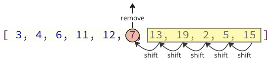

# Insertion Sort

The Insertion Sort algorithm uses one part of the array to hold the sorted values, and the other part of the array to hold values that are not sorted yet.

The algorithm takes one value at a time from the unsorted part of the array and puts it into the right place in the sorted part of the array, until the array is sorted.

### How it works

1. Take the first value from the unsorted part of the array.
2. Move the value into the correct place in the sorted part of the array.
3. Go through the unsorted part of the array again as many times as there are values.

## Manual Run Through

Before we implement the Insertion Sort algorithm in a programming language, let's manually run through a short array, just to get the idea.

**Step 1:** we start with an unsorted array.

[7, 12, 9, 11, 3]

**Step 2:** we can consider the first value as the initial sorted part of the array. If it is just one value, it must be sorted, right?

[<span style="background-color: #FFFF00">7, </span>12, 9, 11, 3]

**Step 3:** The next value 12 should now be moved into the correct position in the sorted part of the array. But 12 is higher than 7, so it is already in the correct position.

[7, <span style="background-color: #FFFF00">12, </span> 9, 11, 3]

**Step 4:** consider the next value 9.

[7, 12, <span style="background-color: #FFFF00">9, </span> 11, 3]

**Step 5:** the value 9 must now be moved into the correct position inside the sorted part of the array, so we move 9 in between 7 and 12.

[7, <span style="background-color: #FFFF00">9, </span> 12, 11, 3]

**Step 6:** the next value is 11.

[7, 9, 12, <span style="background-color: #FFFF00">11, </span> 3]

**Step 7:** we move it in between 9 and 12 in the sorted part of the array.

[7, 9, <span style="background-color: #FFFF00">11, </span>12, 3]

**Step 8:** the last value to insert into the correct position is 3.

[7, 9, 11, 12, <span style="background-color: #FFFF00">3</span>]

**Step 9:** we insert 3 in front of all other values because it is the lowest value.

[<span style="background-color: #FFFF00">3, </span> 7, 9, 11, 12]

## Manual Run Through: What Happened?

We must understand what happened above to fully understand the algorithm, so that we can implement the algorithm in a programming language.

The first value is considered to be the initial sorted part of the array.

Every value after the first value must be compared to the values in the sorted part of the algorithm so that it can be inserted into the correct position.

The Insertion Sort Algorithm must run through the array 4 times, to sort the array of 5 values because we do not have to sort the first value.

And each time the algorithm tuns through the array, the remaining unsorted part of the array becomes shorter.

## Insertion Sort Implementation

To implement the Insertion Sort algorithm in a programming language, we need:

1. An array with values to sort.
2. An outer loop that picks a value to be sorted. For an array with $\ n$ values, this outer loop skips the first value, and must run $\ n - 1$ times.
3. An innert loop that goes through the sorted part of the array, to find where to insert the value. If the value to be sorted is ar index $\ i$, the sorted part of the array starts ar index $\ 0$ and ends at index $\ i - 1$.

The resulting code looks like this:

```c
#include <stdio.h>

int main() {
    int myArray[] = {64, 34, 25, 12, 22, 11, 90, 5};
    int n = sizeof(myArray) / sizeof(myArray[0]);

    for (int i = 1; i < n; i++) {
        int insertIndex = i;
        int currentValue = myArray[i];
        int j = i - 1;

        while (j >= 0 && myArray[j] > currentValue) {
            myArray[j + 1] = myArray[j];
            insertIndex = j;
            j--;
        }
        myArray[insertIndex] = currentValue;
    }

    printf("Sorted array: ");
    for (int i = 0; i < n; i++) {
        printf("%d ", myArray[i]);
    }

    return 0;
}

// Output: "Sorted array: 5 11 12 22 25 34 64 90"
```

## Insertion Sort Improvement

Insertion Sort can be improved a little bit more.

The way the code above first removes a value and then inserts it somewhere else is intuitive. It's how you would do Insertion Sort physically with a hand of cards for example. If low value cards are sorted to the left, you pick uo a new unsorted card, and insert it in the correct place between the other already sorted cards.

The problem with this way of programming it's that when removing a value from the array, all elements above must be shifted one index place down:

<center>
    
</center>

And when inserting the removed value into the array again, there are also many shift operations that must be done: all following elements must shift one position up to make place for the inserted value:

<center>
    
</center>

These shifting operation can take a lot of time, especially for an array with many elements.

## Improved Solution

We can avoid most of these shift operations by only shifting the values necessary.

<center>
    
</center>

In the image above, first value is 7 is copied, then values 11 and 12 are shifted one place up in the array, and at last value 7 is put where value 11 was before.

The number of shifting operations is reduced from 12 to 2 in this case.

This improvement is implemented in the example below:

```c
#include <stdio.h>

int main() {
    int myArray[] = {64, 34, 25, 12, 22, 11, 90, 5};
    int n = sizeof(myArray) / sizeof(myArray[0]);

    for (int i = 1; i < n; i++) {
        int insertIndex = i;
        int currentValue = myArray[i];
        int j = i - 1;

        while (j >= 0 && myArray[j] > currentValue) {
            myArray[j + 1] = myArray[j];
            insertIndex = j;
            j--;
        }
        myArray[insertIndex] = currentValue;
    }

    printf("Sorted array: ");
    for (int i = 0; i < n; i++) {
        printf("%d ", myArray[i]);
    }

    return 0;
}

// Output: "Sorted array: 5 11 12 22 25 34 64 90"
```

## Insertion Sort Time Complexity

Selection Sort sorts an array of $n$ values.

On average, each value must be compared to about $\frac{n}{2}$ other values to find out where to insert it.

And Seletion Sort must run the loop to insert a value in its correct place approximately $n$ times.

We get time complexity for Insertion Sort:

$$\theta( \frac{n}{2} \cdot n) = \underline{\underline{\theta(n^2)}}$$

The time complexity for Insertion Sort can be displayed like this.

<center>
    
</center>
