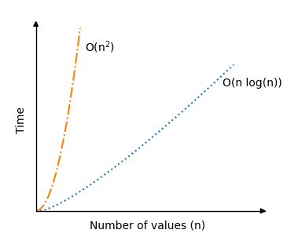

# Quick Sort

As the name suggests, QUicksort is one of the fastestsorting algorithms.

The Quicksort algorithm takes an array of values, chooses one of the values as the "pivot" element, and moves the other values so that lower values are on the left of the pivot element, and higher values are on the right of it.

In this tutorial the last element of the array is chosen to be the pivot element, but we could also have chosen the first element of the array, or any element in the array really.

Then, the QUicksort algorithm foes the same operation recursively on the sub-arrays to the left and right side of the pivot element. This continues until the array is sorted.

> [!TIP] > <b>Recursion</b> is when a function calls itself.
> After the Quicksort algorithm has put the pivot element in between a sub-array with lower values on the left side, and a sub-array with higher values on the right side, the algorithm calls itself twice, so that Quicksort runs again for the sub-array on the left side, and for the sub-array on the right side. The Quicksort algorithm continues to call itself until the sub-arrays are too small to be sorted.

The algorithm can be describe like this:

### How it works

1. Choose a value in the array to be the pivot element.
2. Order the rest of the array so that lower values than the pivot element are on the left, and higher values are on the right.
3. Swap the pivot element with the first element of the higher values so that the pivot element lands in between the lower and higher values.
4. Do the same operations (recursively) for the sub-arrays on the left and right side of the pivot element.

## Manual Run Through

Before we implement the Quicksort algorithm in a programming language, let's manually run through a short array, just to get idea.

**Step 1:** we start with an unsorted array.

[11, 9, 12, 7, 3]

**Step 2:** we choose the last value 3 as the pivot element.

[11, 9, 12, 7, <span style="background-color: #FFFF00">3</span>]

**Step 3:** the rest of the values in the array are all lower than 3, an must be on the right side of 3. Swap 3 with 11.

[<span style="background-color: #FFFF00">3, </span>9, 12, 7, <span style="background-color: #FFFF00">11</span>]

**Step 4:** value 3 is now in the correct position. We need to sort the values to the right of 3. We choose the last value 11 as the new pivot element.

[3, 9, 12, 7, <span style="background-color: #FFFF00">11</span>]

**Step 5:** the value 7 must be to left of pivot value 11, and 12 must be to the right of it. Move 7 and 12.

[3, 9, <span style="background-color: #FFFF00">7, 12, </span>11]

**Step 6:** swap 11 with 12 so that lower values 9 and 7 are on the left side of 11, and 12 is on the right side.

[3, 9, 7, <span style="background-color: #FFFF00">11, 12</span>]

**Step 7:** 11 and 12 are in the correct positions. We choose 7 as the pivot element in sub-array [9, 7], to the left of 11.

[3, 9, <span style="background-color: #FFFF00">7, </span>11, 12]

**Step 8:** we must swap 9 with 7.

[3, <span style="background-color: #FFFF00">7, 9, </span>11, 12]

And now, the array is sorted.

## Manual Run Through: What Happened?

Before we implement the algorithm in a programming language we need to go through what happened above in more detail.

We have already seed that last value of the array is chosen as the pivot element, and the rest of the values are arranged so that the values lower than the pivot value are to the left, and the higher values are to the right.

After that, the pivot element is swapped with the first of the higher values. This splits the original array in two, with the pivot element in between the lower and the higher values.

Now we need to do the same as above with the sub-arrays on the left and right side of the old pivot element. And if a sub-array has length 0 or 1, we consider it finished sorted.

To sum up, the Quicksort algorithm makes the sub-arrays become shorter and shorter until array is sorted.

## Quicksort Implementation

To qrite a "quickSort" method that splits the array into shorter and shorter sub-arrays we used recursion. This means that the "quickSort" method must call itself with the new sub-arrays to the left and right of the pivot element.

1. An array with values to sort.
2. A `quickSort` method that calls itself (recursion) if the sub-arrays has a size larger than 1.
3. A `partition` method that receives a sub-array, moves values around, swaps the pivot element into the sub-array and returns the index where the next split in sub-arrays happens.

The resulting code looks like this:

```c
#include <stdio.h>

void quicksort(int array[], int low, int high);
int partition(int array[], int low, int high);

int main() {
    int myArray[] = {64, 34, 25, 12, 22, 11, 90, 5};
    int n = sizeof(myArray) / sizeof(myArray[0]);

    quicksort(myArray, 0, n - 1);

    printf("Sorted array: ");
    for (int i = 0; i < n; i++) {
        printf("%d ", myArray[i]);
    }
    return 0;
}

void quicksort(int array[], int low, int high) {
    if (low < high) {
        int pivotIndex = partition(array, low, high);
        quicksort(array, low, pivotIndex - 1);
        quicksort(array, pivotIndex + 1, high);
    }
}

int partition(int array[], int low, int high) {
    int pivot = array[high];
    int i = low - 1;

    for (int j = low; j < high; j++) {
        if (array[j] <= pivot) {
            i++;
            int temp = array[i];
            array[i] = array[j];
            array[j] = temp;
        }
    }

    int temp = array[i + 1];
    array[i + 1] = array[high];
    array[high] = temp;
    return i + 1;
}

// Output: "Sorted array: 5 11 12 22 25 34 64 90"
```

## Quicksort Time Complexity

The worst case scenario for Quicksort is $\theta(n^2)$. This is when the pivot elementis either the highest or lowest value in every sub-array, which leads to a lot of recursive calls. With our implementation above, this happens when the array is already sorted.

But on average, the time complexity for Quicksort is actually just $\theta(n \log n)$, which is a lot better than for the previous sorting algorithms we have looked at. That is why Quicksort is so popular.

Below you can see the significant improvement in time complexity for Quicksort in an average scenario $\theta(n \log n)$, compared to the previous sorting algorithms Bubble, Selection an Insertion Sort with time complexity $\theta(n^2)$:

<center>
    
</center>

The recursion part of the Quicksort algorithm is actually a reason why the average sorting scenario is so fast, because for good picks of the pivot element, the array will be split in half somewhat evenly each time the algorithm calls itself. So the number of recursive calls do not double, even if the number of values $n$ double.
