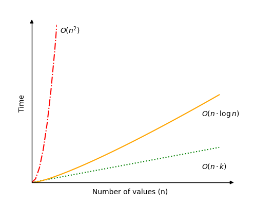

# Radix Sort

O algoritmo Radix Sort classifica uma matriz por dígitos individuais, começando com o dígito menos significativo (o mais à direita).

A raiz (ou base) é o número de fígitos únicos em um sistema numérico. No sistema decimal que normalmente usamos, existem 10 dígitos diferentes de 0 a 9.

Radix Sort usa a base para que os valores decimais sejam colocados em 10 baldes (ou contêineres) diferentes correspondentes ao dígito que está em foco e, em seguida, colocados de volta na matriz antes de passar para o próximo dígito.

Radix Sort é um algoritmo não comparativo que funciona apenas com números inteiros não negativos.

O algoritmo Radix Sort pode ser descrito assim:

### Como funciona

1. Comece com o dígito menos significativo (digito mais à direita).
2. Classifique os valores com base no dígito em foco, primeiro colocando os valores no intervalo correto com base no dígito em foco e, em seguida, coloque-os novamente na matriz na ordem correta.
3. Passe para o próximo dígito e classifique novamente, como na etapa acima, até que não haja mais dígitos.

## Classificação Estável

Radix Sort deve classificar os elementos de forma estável para que o resultado seja classificado corretamente.

Um algoritmo de classificação estável é um algoritmo que mantém a ordem dos elementos com o mesmo valor de antes e depois da classificação. Digamos que temos dois elementos "K" e "L", onde "K" vem antes de "L", e ambos têm o valor "3". Um algoritmo de classificação é considerado estável se o elemento "K" ainda vier antes de "L" após a classificação da matriz.

Não faz muito sentido falar sobre algoritmos de classificação estáveis para os algoritmos anteriores que examinamos individualmente, pois o resultado seria o mesmo se eles fossem estáveis ou não. Mas é importante para o Radix Sort que a classificação seja feita de forma estável porque os elementos são classificados por apenas um dígito de cada vez.

Portanto, após classificar os elementos no dígito menos significativo e passar para o próximo dígito, é importante não destruir o trabalho de classificação que já foi feito na possição do dígito anterior, e é por isso que precisamos tomar cuidado para que o Radix Sort não a classificação em cada posição de dígito de maneira estável.

## Execução Manual

Vamos fazer a classificação manualmente, apenas para entender ainda melhor como o Radix Sort funciona antes de implementá-lo em uma linguagem de programação.

**Etapa 1:** começamos com um array não classificado e um array vazio para ajustar os valores com radices correspondentes de 0 a 9.

myArray = [ 33, 45, 40, 25, 17, 24]

radixArray = [ [], [], [], [], [], [], [], [], [], [] ]

**Etapa 2:** começamos a classificação concentrando-nos no dígito menos significativo.

myArray = [3<span style="background-color: #FFFF00">3</span>, 4<span style="background-color: #FFFF00">5</span>, 4<span style="background-color: #FFFF00">0</span>, 2<span style="background-color: #FFFF00">5</span>, 1<span style="background-color: #FFFF00">7</span>, 2<span style="background-color: #FFFF00">4</span>]

radixArray = [ [], [], [], [], [], [], [], [], [], [] ]

**Etapa 3:** agora movemos os elementos para posições corretas no array radix de acordo com o dígito em foco. Os elementos são retirados do início do myArray e colocados na posição correta no radixArray.

myArray = [ ]

radixArray = [ [4<span style="background-color: #FFFF00">0</span>], [], [], [3<span style="background-color: #FFFF00">3</span>], [2<span style="background-color: #FFFF00">4</span>], [4<span style="background-color: #FFFF00">5</span>, 2<span style="background-color: #FFFF00">5</span>], [], [1<span style="background-color: #FFFF00">7</span>], [], [] ]

**Etapa 4:** movemos os elementos de volta para o array inicial e a classificação agora é feita para o dígito menos significativo. Os elementos são retirados do final do radixArray e colocados no início do myArray.

myArray = [ 4<span style="background-color: #FFFF00">0</span>, 3<span style="background-color: #FFFF00">3</span>, 2<span style="background-color: #FFFF00">4</span>, 4<span style="background-color: #FFFF00">5</span>, 2<span style="background-color: #FFFF00">5</span>, 1<span style="background-color: #FFFF00">7</span> ]

radixArray = [ [], [], [], [], [], [], [], [], [], [] ]

**Etapa 5:** movemos o foco para o próximo dígito. Observe que os valores 45 e 25 ainda estão na mesma ordem relativa entre si como estavam no início, porque classificamos de maneira estável.

myArray = [ <span style="background-color: #FFFF00">4</span>0, <span style="background-color: #FFFF00">3</span>3, <span style="background-color: #FFFF00">2</span>4, <span style="background-color: #FFFF00">4</span>5, <span style="background-color: #FFFF00">2</span>5, <span style="background-color: #FFFF00">1</span>7 ]

radixArray = [ [], [], [], [], [], [], [], [], [], [] ]

**Etapa 6:** movemos os elementos para o array radiz de acordo com o dígito em foco.

myArray = [ ]
radixArray = [ [], [<span style="background-color: #FFFF00">1</span>7], [<span style="background-color: #FFFF00">2</span>4, <span style="background-color: #FFFF00">2</span>5], [<span style="background-color: #FFFF00">3</span>3], [<span style="background-color: #FFFF00">4</span>0, <span style="background-color: #FFFF00">4</span>5], [], [], [], [], [] ]

**Etapa 7:** movemos os elementos de volta para o início do myArray, na parte de trás do radixArray.

myArray = [ <span style="background-color: #FFFF00">1</span>7, <span style="background-color: #FFFF00">2</span>4, <span style="background-color: #FFFF00">2</span>5, <span style="background-color: #FFFF00">3</span>3, <span style="background-color: #FFFF00">4</span>0, <span style="background-color: #FFFF00">4</span>5 ]
radixArray = [ [], [], [], [], [], [], [], [], [], [] ]

A classificação está concluída!

## Execução Manual: O que aconteceu?

Vemos que os valores são movidos do array e colocados no array de base de acordo com a base atual em foco. E então os valores são movidos de volta para a matriz que queremos classificar.

Essa movimentação de valores que queremos classificar e vice-versa deve ser feita tantas vezes quanto o número máximo de dígitos em um valor. Assim, por exemplo, se 437 for o número mais alto na matriz que precisa ser classificado, sabemos que devemos classificar três vezes, uma para cada dígito.

Vemos também que a matriz de base precisa ser bidimensional para que haja mais de um valor em uma base ou índice específico.

E, como mencionado anteriormente, devemos mover os valores entre os dois arrays de uma forma que mantenha a ordem dos valores com a mesma base em foco, para que a classificação seja estável.

## Implementação de Classificação Radix

Para implementar o algoritmo Radix Sort, precisamos:

1. Uma matriz com inteiros não negativos que precisa ser classificada.
2. Uma matriz bidimensional com índice de 0 a 9 para armazenar valores com a base atual em foco.
3. Um loop que pega valores da matriz não classificada e os coloca na posição correta na matriz de base bidimensional.
4. Um loop que coloca valores de volta na matriz inicial a partir da matriz raiz.
5. Um loop externo que é executado quantas vezes houver dígitos no valor mais alto.

O código resultante fica assim:

```c
myArray = [170, 45, 75, 90, 802, 24, 2, 66]
print("Original array:", myArray)
radixArray = [[], [], [], [], [], [], [], [], [], []]
maxVal = max(myArray)
exp = 1

while maxVal // exp > 0:

    while len(myArray) > 0:
        val = myArray.pop()
        radixIndex = (val // exp) % 10
        radixArray[radixIndex].append(val)

    for bucket in radixArray:
        while len(bucket) > 0:
            val = bucket.pop()
            myArray.append(val)

    exp *= 10

print("Sorted array:", myArray)
```

**Na linha 7**, usamos a divisão floor ("//") para dividir o valor máximo 802 por 1 na primeira vez que o loop while é executado, na próxima vez ele é dividido por 10 e na última vez que é dividido por 100. Quando usamos a divisão mínima "//", qualquer número além da vírgula devimal é desconsiderado e um número inteiro é retornado.

**Na linha 11**, é decidido onde colocar um valor no radixArray com base em sua raiz, ou dígito em foco. Por exemplo, na segunda vez em que o loop while externo for executado, exp será 10. O valor 170 dividido por 10 será 17. A operação "%10" divide por 10 e retorna o que resta. Neste caso, 17 é dividido por 10 uma vez e sobra 7, o valor 170 é colocado no índice 7 do radixArray.

## Classificação Radix usando outros algoritmos de classificação

Na verdade, o Radix Sort pode ser implementado junto com qualquer outro algoritmo de classificação, desde que seja escalável. Isso significa que quando se trata de classificar um dígito específico, qualquer algoritmo de classificação estável funcionará, como classificação por contagem ou classificação por bolha.

Esta é uma implementação do Radix Sort que usa Bubble Sort para classificar os dígitos individuais:

```c
def bubbleSort(arr):
    n = len(arr)
    for i in range(n):
        for j in range(0, n - i - 1):
            if arr[j] > arr[j + 1]:
                arr[j], arr[j + 1] = arr[j + 1], arr[j]

def radixSortWithBubbleSort(arr):
    max_val = max(arr)
    exp = 1

    while max_val // exp > 0:
        radixArray = [[],[],[],[],[],[],[],[],[],[]]

        for num in arr:
            radixIndex = (num // exp) % 10
            radixArray[radixIndex].append(num)

        for bucket in radixArray:
            bubbleSort(bucket)

        i = 0
        for bucket in radixArray:
            for num in bucket:
                arr[i] = num
                i += 1

        exp *= 10

myArray = [170, 45, 75, 90, 802, 24, 2, 66]
print("Original array:", myArray)
radixSortWithBubbleSort(myArray)
print("Sorted array:", myArray)
```

## Complexidade de tempo de classificação Radix

A complexidade de tempo para Radix Sort é:

$$\underline{\underline{O(n \cdot k)}}$$

Isso significa que Radix Sort depende dos valores que precisam ser classificados $n$, e o número de dígitos no valor mais alto $k$.

O melhor cenário para o Radix Sort é se houver muitos valores para classificar, mas os valores tiverem poucos dígitos. Por exemplo, se houver mais de um milhão de valores para classificar e o valor mais alto for 999, com apenas três dígitos. Nesse caso, a complexidade do tempo $O(n \cdot k)$ pode ser simplificada para apenas $O(n)$.

O pior cenário para Radix Sort seria se houvesse tantos dígitos no valor mais alto quanto valores para classificar. Este talvez não seja um cenário comum, mas a complexidade de tempo seria $O(n^2)$ nesse caso.

O caso médio ou comum, seria talvez se o número de dígitos $k$ fosse algo como $k(n)= \log n$. Nesse caso, Radix Sort obtém complexidade de tempo $O(n \cdot \log n )$. Um exemplo de tal caso seria se houvesse 1.000.000 valores para classificar e os valores tivessem 6 dígitos.

As diferentes complexidades de tempo possíveis para Radix Sort estão na imagem abaixo.

<center>
    
</center>
