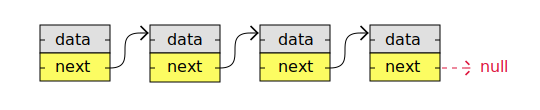

# Linked List

Uma Lista Ligada é, como indicado em seu nome, uma lista onde os nós estão vinculados. Cada nó contém dados e um ponteiro. A forma como eles estão interligados é que cada nó aponta para outra posição de memória que contém o outro nó.

As listas ligadas, consistem de nós com algum tipo de dados e um ponteiro, ou link, para o próximo nó.

    

Um grande benefício do uso de listas ligadas é que os nós são armazenados sempre que houver espaço livre na memória; os nós não precisam ser armazenados continuamente, um após o outro, como os elementos armazenados em arrays. Outra coisa interessante das listas ligadas é que, ao adicionar ou remover nós, o restante dos nós da lista não precisam ser deslocados.

## Lista Ligada versus Arrays

A maneira mais fácil de entender as listas ligadas talvez seja comparando listas ligadas com arrays.

As listas ligadas consistem em nós e são uma estrutura de dados linear que nós mesmos criamos, ao contrário dos arrays, que é uma estrutura de dados existente na linguagem de programação.

Os nós em uma lista ligada armazenam links para outros nós, mas os elementos do array não precisam armazenar links para outros elementos.

A tabela abaixo compara listas ligadas com arrays para dar uma melhor compreensão do que são listas ligadas.

|                                                                                                                             | Arrays | Linked Lists |
| --------------------------------------------------------------------------------------------------------------------------- | ------ | ------------ |
| Uma estrutura de dados existente na linguagem de programação                                                                | Yes    | No           |
| Tamanho fixo na memória                                                                                                     | Yes    | No           |
| Elementos, ou nós, são armazenados um após o outro na memória (contíguamente)                                               | Yes    | No           |
| O uso de memória é baixo (cada nó contém apenas dados, sem links para outros nós)                                           | Yes    | No           |
| Elementos, ou nós, podem ser acessados diretamente (acesso aleatório)                                                       | Yes    | No           |
| Elementos, ou nós, podem ser inseridos ou excluídos em tempo constante, sem necessidade de operações de mudança na memória. | No     | Yes          |

<!-- ## Listas Ligadas na Memória

**Memória do computador:** a memória do computador é o armazenamento que seu programa usa quando está em execução. É aqui que suas variáveis, arrays e listas ligadas são armazenadas.

### Variáveis na memória -->
