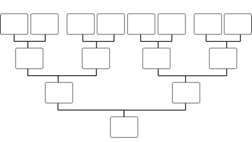

# DSA

Uma maneira eficiente de armazenar dados.

## O que são estruturas de dados?

Estruturamos os dados de diferentes maneiras, dependendo dos dados que temos e do que queremos fazer com eles.

Primeiro, vamos considerar um exemplo sem computadores em mente, apenas para se ter uma ideia.

    

Se quisermos armazenar dados sobre pessoas com quem temos parentesco, usamos uma árvore genealógica como estrutura de dados. Escolhemos uma árvore genealógica como estrutura de dados porque temos informações sobre pessoas com quem temos parentesco e como elas se relacionam, e queremos uma visão geral para que possamos encontrar facilmente um membro específico da família, há várias gerações.

Com uma estrutura de dados da sua árvore genealógica seria fácil ver, por exemplo, quem é a mãe da sua mãe – sua avó no caso, certo? Mas sem as ligações entre pais e filhos presentes na árvore, seria difícil determinar como os indivíduos estão relacionados.

Uma estrutura de dados nos fornece a possibilidade de gerenciar grandes quantidades de dados de forma eficiente para usos como grandes bancos de dados e serviços de indexação na Internet.

As estruturas de dados são ingredientes essenciais na criação de algoritmos rápidos e poderosos. Eles ajudam no gerenciamento e organização de dados, reduzem a complexidade e aumentam a eficiência.

## Diferentes tipos de estruturas de dados

Na ciência da computação existem dois tipos diferentes de estruturas de dados.

**Estruturas de dados primitivas:** são estruturas de dados básicas fornecidas por linguagens de programação para representar valores únicos, como inteiros, números de ponto flutuante, caracteres e booleanos.

**Estruturas de dados abstratas:** são estruturas de dados de nível superior criadas usando tipos de dados primitivos e fornecem operações mais complexas e especializadas. Alguns exemplos de estruturas de dados abstratas incluem arrays, listas vinculadas, pilhas, filas, árvores e grafos.

## O que são algoritmos?

Um algoritmo é um conjunto de instruções passo a passo para resolver um determinado problema ou atingir um objetivo específico.

Por exemplo, pense em uma receita escrita em um pedaço de papel, onde o objetivo é fazer determinado jantar. Os passos necessários para fazer um jantar específico são descritos com exatidão.

Quando falamos de algoritmos em ciência da computação, as instruções passo a passo são escritas em uma linguagem de programação, um algoritmo utiliza estruturas de dados.

Algoritmos são fundamentais para a programação de computadores, pois fornecem instruções passo a passo para a execução de tarefas. Um algoritmo eficiente pode nos ajudar a encontrar a solução que procuramos e transformar um programa lento em um mais rápido.

Ao estudar algoritmos, os desenvolvedores podem criar programas melhores.

Exemplos de algoritmos:

- Encontrar o trajeto mais rápido em um sistema de navegação GPS;
- Navegar num avião ou num carro (controlo de cruzeiro);
- Encontrar o que os usuários procuram (motor de busca);
- Classificação, por exemplo, classificação de filmes por avaliações.

Os algoritmos que veremos neste arquivo são projetados para resolver problemas específicos e geralmente são feitos para funcionar em estruturas de dados específicas. Por exemplo, o algoritmo "Bubble Sort" foi projetado para classificar valores e funciona em arrays.

## Estruturas de dados junto com algoritmos

Estruturas de dados e algoritmos (DSA) andam de mãos dadas. Uma estrutura de dados (DS) não vale muito se você não puder pesquisá-la ou manipulá-la de forma eficiente usando algoritmos, e os algoritmos aqui contidos não valem muito sem uma DS para trabalhar.

DSA trata de encontrar maneiras eficientes de armazenar e recuperar dados, de realizar operações em dados e de resolver problemas específicos.

Ao compreender o DSA, você pode:

- Decidir qual estrutura de dados ou algoritmo é melhor para determinada situação;
- Faça programas que rodem mais rápido ou usem menos memória;
- Compreender como abordar problemas complexos e resolvê-los de forma sistemática.

## Onde o DSA é necessário?

Os DSA são usados ​​em praticamente todos os sistemas de software, desde sistemas operacionais até aplicativos da web:

- Para gerir grandes quantidades de dados, como numa rede social ou num motor de busca;
- Para agendar tarefas, para decidir qual tarefa um computador deve primeiro;
- Para planejar rotas, como em um sistema GPS para encontrar o caminho mais curto entre A e B;
- Para otimizar processos, como organizar tarefas para que possam ser concluídas o mais rápido possível;
- Para resolver problemas complexos: desde encontrar a melhor forma de embalar um caminhão até fazer um computador 'aprender' com os dados.

O DSA é fundamental em quase todas as partes do mundo do software:

- Sistemas operacionais;
- Sistemas de banco de dados;
- Aplicativos da web;
- Aprendizado de máquina;
- Vídeo games;
- Sistemas criptográficos;
- Análise de dados;
- Motores de busca.

## Teoria e Terminologia

À medida que avançamos neste arquivo, novos conceitos teóricos e terminologia serão necessários para que possamos compreender melhor o DSA em que trabalharemos.

Estas novas palavras e conceitos serão introduzidos e explicados adequadamente quando forem necessários, mas aqui está uma lista de alguns termos-chave, apenas para ter uma visão geral do que está por vir.

| Prazo                   | Descrição                                                                                                                                                                                                                       |
| :---------------------- | :------------------------------------------------------------------------------------------------------------------------------------------------------------------------------------------------------------------------------ |
| Algoritmo               | Um conjunto de instruções passo a passo para resolver um problema específico.                                                                                                                                                   |
| Estrutura de Dados (DS) | Uma forma de organizar os dados para que possam ser usados ​​com eficiência. Estruturas de dados comuns incluem arrays, listas vinculadas e árvores binárias.                                                                   |
| Complexidade do tempo   | Uma medida da quantidade de tempo que um algoritmo leva para ser executado, dependendo da quantidade de dados em que o algoritmo está trabalhando.                                                                              |
| Complexidade Espacial   | Uma medida da quantidade de memória que um algoritmo usa, dependendo da quantidade de dados em que o algoritmo está trabalhando.                                                                                                |
| Notação Big O           | Uma notação matemática que descreve o comportamento limitante de uma função quando o argumento tende para um determinado valor ou infinito. Usado neste tutorial para descrever a complexidade de tempo de um algoritmo.        |
| Recursão                | Uma técnica de programação em que uma função chama a si mesma.                                                                                                                                                                  |
| Dividir e Conquistar    | Um método de resolver problemas complexos dividindo-os em subproblemas menores e mais gerenciáveis, resolvendo os subproblemas e combinando as soluções. A resursão é frequentemente usada ao usar esse método em um algoritmo. |
| Força Bruta             | Uma maneira simples e direta de um algoritmo funcionar, simplesmente tentando todas as soluções possíveis e então escolhendo a melhor.                                                                                          |
